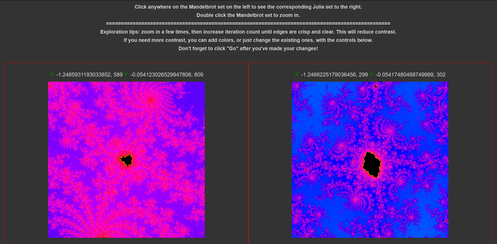
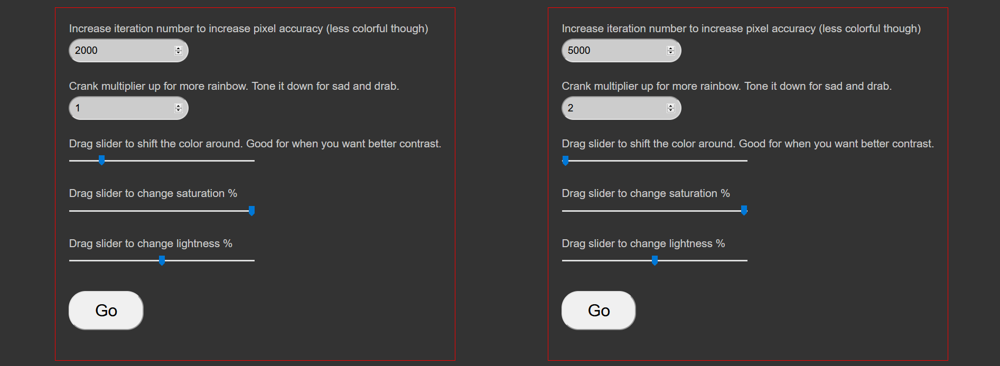

# Fractal Explorer

Explore the Mandelbrot and Julia sets with your mouse. That's... pretty much it. Thanks to the Coding Train for the inspiration and help!

[Live website](https://amaralis.github.io/mandelbrot/)

## How to use

Click on the left canvas (displaying the Mandelbrot set) to see the corresponding Julia set on the right. Double-click to zoom in.
Increase iteration count to increase the resolution, and use the other controls to adjust colors.

## What I set out to achieve with this project

- [X] A way to explore the Mandelbrot set
- [X] Learn how to use web workers to perform intensive, time-consuming calculations
- [X] Take advantage of meta tags for a good social media experience
- [ ] Creating clean, maintainable code
- [ ] Displaying fractals with stunning beauty

## What I learned

* The workflow for using webworkers
* Not to rely on what I think an application's scope might be, in order to excuse code that's not scalable. Implementing the Julia set's visualization wasn't even on my mind when I set out to do this. As I decided the two were too beautifully intertwined not to add it in, I had to choose between getting the project done quickly, or go back and perform a heavy, time-consuming refactor. I went with the first one. The consequences are very well visible within the repo

## How it works

On the strictly technical side, the canvas where the fractal is drawn is split up into as many pieces as the navigator's hardware's available logical cores. This is achieved by dividing the actual image data, the pixel data array, into chunks, and sending each chunk to a worker. An interesting challenge here is that the image needs to be "reassembled" in the correct order when the new pixel data is delivered by each worker.
The coloring algorithm is extremely simple, so stunning effects like those one may have seen elsewhere aren't achievable.
